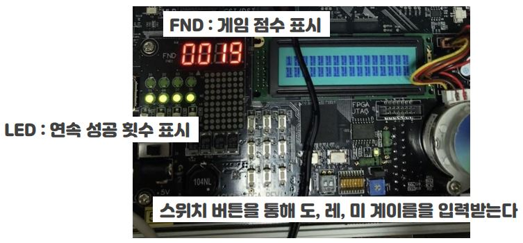
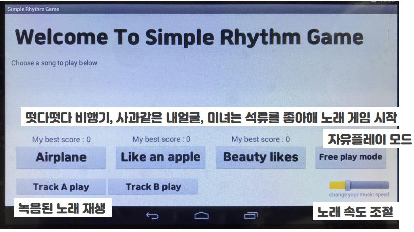
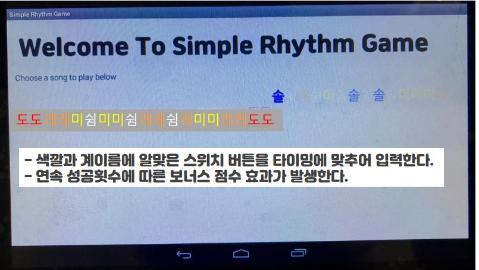
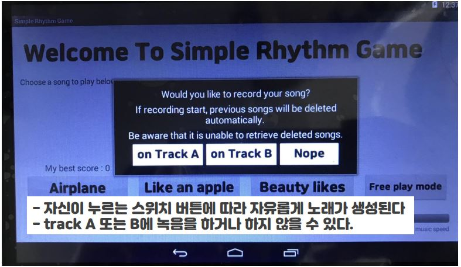
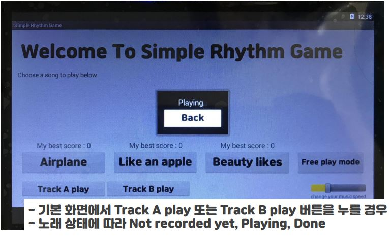

## 도레미 리듬게임
>안드로이드 프로그래밍 기법 연습을 위한 간단한 개인 프로젝트 진행

### 개발 목표
  - 습득한 리눅스 시스템 프로그램 및 안드로이드 프로그래밍 기법을 사용하여 새로운 소프트웨어를 개발할 수 있다.
  
### 프로젝트 개요
  1) 음악에 따른 타이밍에 맞추어 도레미 버튼을 누르는 리듬게임, 자신이 제작한 노래를 간단하게 녹음할 수도 있다.
  2) 사용된 디바이스 드라이버
  
  
  
    FND : 현재 게임 점수를 출력한다.
    LED : 현재 게임에서의 연속 성공 횟수(0~5)를 출력한다. 또는 보너스 점수 효과(8)를 나타낸다.
    스위치 버튼 : 계이름을 입력받는다.
                  (1)도 (2)레 (3)미 (4)파 (5)솔 (6)라 (7)시 (8)높은 도 (9)높은 레
  3) 안드로이드 프로그램
  - 기본 화면 : 첫 메인 화면
  
  
      
      Airplane 버튼 : 떳다떳다 비행기 게임 시작
      Like an apple : 사과 같은 내 얼굴 게임 시작
      Beauty likes : 미녀는 석류를 좋아해 게임 시작
      My best score : 각 게임에 대한 나의 최고 점수 기록
      Free play mode : 유저가 원하는 음으로 track A 또는 track B에 녹음을 하거나 자유 플레이를 할 수 있다.
      Track A play : track A 에 저장된 음악 재생
      Track B play : track B 에 저장된 음악 재생
      seekBar : 음악 재생 속도를 조절할 수 있다.
  - 게임 모드 : 세 가지 게임에 대한 시작 버튼(Airplane, Like an apple, Beauty likes)을 누르면 나오는 화면
  
    - 계이름 텍스트 : 눌러야 할 스위치 버튼에 대한 색깔 및 계이름이 텍스트로 표시된다. 현재 누른 스위치 버튼에 대한 글자가 버튼에 따른 계이름과 색깔로 변한다. 앞에서부터 글자가 타이밍에 맞게 사라진다. 유저는 타이밍에 맞추어 계이름에 맞는 스위치 버튼을 누르는 것을 목표로 한다.
      - 쉼 : 하얀색, 도 : 빨간색, 레 : 주황색, 미 : 노란색, 파 : 초록색, 솔 : 파란색, 라 : 남색, 시 : 보라색, 높은 도 : 진한 분홍색, 높은 레 : 진한 주황색
    - 다음과 같을 때 ‘유저가 올바른 계이름을 누른 경우’라고 한다. 이 때 기본 1점을 얻는다.
        ```빨간색 도에서 1번 스위치를 누른 경우
        주황색 레에서 2번 스위치를 누른 경우
        미에서 3번 스위치를 누른 경우
        파에서 4번 스위치를 누른 경우
        솔에서 5번 스위치를 누른 경우
        라에서 6번 스위치를 누른 경우
        시에서 7번 스위치를 누른 경우
        진한 분홍색 도(높은 도)에서 8번 스위치를 누른 경우
        진한 주황색 레(높은 레)에서 9번 스위치를 누른 경우
    - 다음과 같을 때 ‘유저가 틀린 계이름을 누른 경우’라고 한다. 이 때 연속 횟수가 0으로 초기화 되고 보너스 점수 효과가 있을 경우 사라진다.
        ```쉼인데 스위치 버튼을 누른 경우
        계이름을 눌러야 하는 데 누르지 않은 경우
        다른 계이름을 누른 경우
    - 연속 성공 횟수 : 연속적으로 유저가 올바른 계이름을 누른 경우 연속 성공 횟수가 증가한다. 연속 성공 회수는 led 불로 나타난다.
    - Fever Time(보너스 점수 효과) : 기본 1점이 아닌 보너스 점수를 얻는 상태이다.
      - Fever 1단계에서 기본 점수의 2배, 2단계에서 4배, 3단계에서 6배의 점수를 받는다. (각 2점, 4점, 6점)
      - 기본 상태에서 Fever Time은 없다.
      - 기본 상태에서 5번 연속 올바른 계이름을 눌렀을 경우 Fever 1 단계에 진입한다. Fever 1단계에서 3번 연속 올바른 계이름을 누를 경우 2단계, 2단계에서 3번 연속 올바른 계이름을 누를 경우 3단계에 진입한다. 3단계보다 높은 단계는 없다. 계속 올바른 계이름을 누를 경우 Fever Time이 유지된다.
      - 단계와 상관없이 Fever Time에 진입했을 때 1번이라도 틀린 계이름을 누를 경우 Fever Time 효과가 사라지고 기본 상태로 돌아간다.
      - Fever Time중에는 8개의 led가 모두 켜진다.
    - 게임 도중 받은 점수는 fpga fnd로 최대 4자리까지 나타난다.
    - 노래가 끝나면 Complete버튼이 나타난다. 버튼을 누르면 기본 화면으로 돌아간다. 이 때 해당 게임에 대한 나의 최고 점수가 변경될 수 있다.
  - 자유 플레이 모드
    
    
    
    - 기본 화면에서 Free play mode를 누르면 새로운 창이 나타나고 새로운 창에서 Track A, Track B, Nope 중에 하나를 선택할 수 있다.
        ```on Track A : Track A에 녹음을 시작한다
        on Track B : Track B에 녹음을 시작한다
        Nope : 녹음을 하지 않고 자유롭게 플레이한다.
        녹음을 시작할 경우 해당 트랙에 전에 저장된 음악은 자동으로 없어진다.
    - 계이름 텍스트 : 자유 플레이 모드에서는 유저 마음대로 플레이 하는 것이기 때문에 눌러야 하는 계이름은 존재하지 않는다. 유저가 누르는 버튼에 따라 계이름과 색깔만 바꾸어준다.
    - Complete 버튼을 누르면 노래 및 녹음이 종료되고 기본 화면으로 돌아간다.
  - 녹음 음악 실행 모드
    
    
    
    - 자유 플레이 모드에서 녹음했던 노래가 존재할 경우 저장된 노래가 나온다.
    - 기본 화면에서 Track A play 또는 Track B play 버튼을 누르면 새로운 창이 뜬다.
    - 녹음된 음악이 없을 경우 : Not recorded yet!
    - 녹음된 음악이 있을 경우 : Playing..
    - 음악 재생이 끝난 경우 : Done!
    - Back 버튼을 누르면 음악 재생이 멈추고 기본 화면으로 돌아간다.
    
### 개발 방법
    - Host PC : Linux(Ubuntu 16.04) System on x64 architecture
    - Target Board : Embedded linux system on ARM architecture
    
### 추진 일정 및 내용
  - 2020.06.22 : 아이디어 구상, 기본 안드로이드 프로그래밍 공부
  - 2020.06.23 : jni 프로그래밍, 기본 화면 안드로이드 프로그래밍, 떳다떳다 비행기 곡 추가
  - 2020.06.24 : MediaPlayer를 사용하여 계이름이 출력되도록 설정, 최고 점수 기능 추가, 사과 같은 내얼굴, 미녀는 석류를 좋아해 곡 추가, 음악 속도 설정 기능 추가
  - 2020.06.25 : 자유 플레이 모드 구현 시작
  - 2020.06.26 : 자유 플레이 모드 구현 완료, FreePlayActivity, TrackPlayActivity 추가
  - 2020.06.27 : 버그 수정, 보고서 
    
    
    
